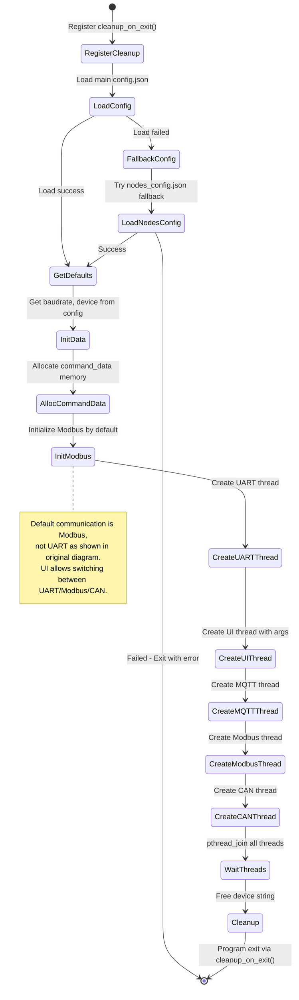
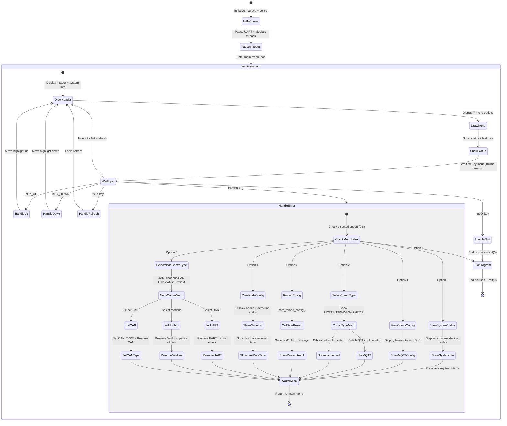
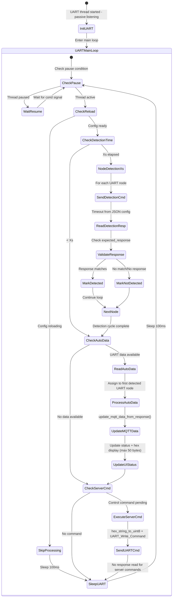
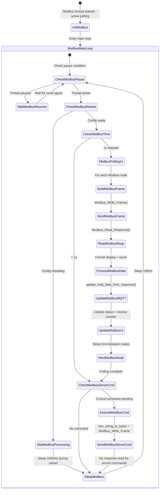
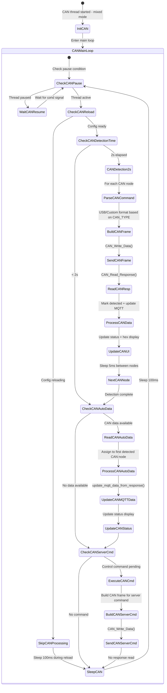
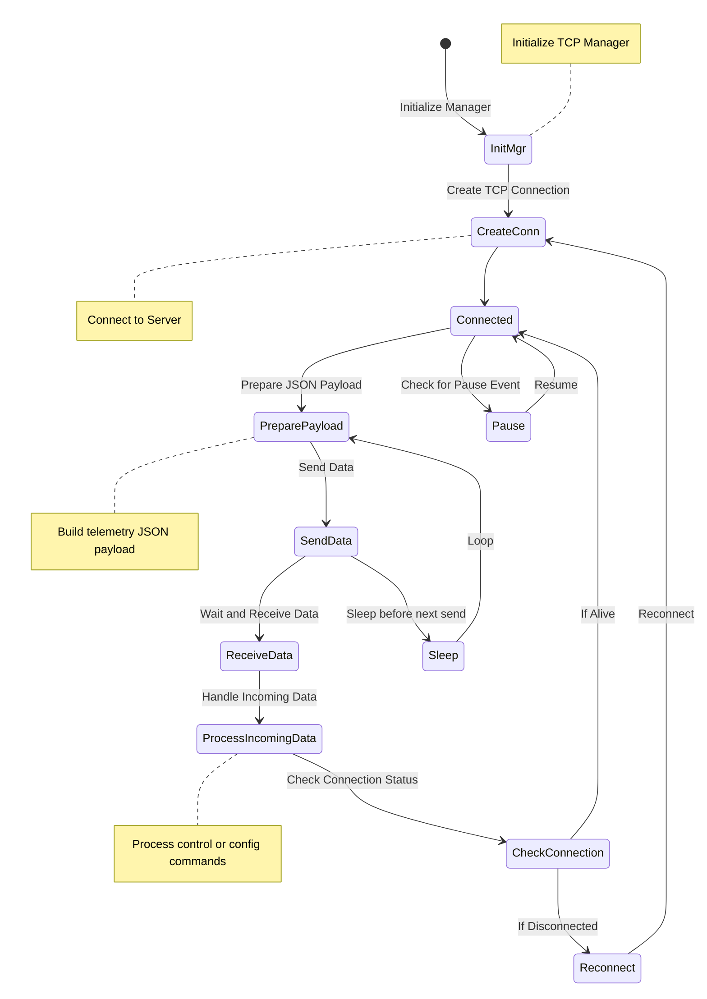

### Sơ đồ hệ thống (sơ đồ chức năng):

## Sơ đồ State Machine Hệ thống

### Main Thread Activity Diagram

### UI (Controller / Configarator) Thread Activity Diagram

### UART Communication Thread ACtivity Diagram

### MODBUS Communication Thread Activity Diagram

### CAN Communication Thread Acitivity Diagram

### MQTT Send to thingsboard Thread State Machine:

```mermaid
stateDiagram-v2
    [*] --> LoadMQTTConfig: Load MQTT config
    LoadMQTTConfig --> NoMQTTConfig: Config missing
    LoadMQTTConfig --> InitMosquitto: Config available
    
    NoMQTTConfig --> [*]: Exit thread
    
    InitMosquitto --> CreateMosquittoClient: mosquitto_new()
    CreateMosquittoClient --> ClientFailed: Creation failed
    CreateMosquittoClient --> SetCredentials: mosquitto_username_pw_set()
    
    ClientFailed --> [*]: Exit thread
    
    SetCredentials --> SetCallbacks: Set connect/disconnect/message callbacks
    SetCallbacks --> ConnectBroker: mosquitto_connect()
    ConnectBroker --> ConnectFailed: Connection failed
    ConnectBroker --> StartLoop: mosquitto_loop_start()
    
    ConnectFailed --> MQTTCleanup: Destroy client + cleanup
    MQTTCleanup --> [*]
    
    StartLoop --> WaitConnection: Wait for mqtt_connected flag
    WaitConnection --> ConnectionTimeout: Timeout expired
    WaitConnection --> RequestInitialConfig: Connected successfully
    
    ConnectionTimeout --> StopLoop: mosquitto_loop_stop
    StopLoop --> MQTTCleanup
    
    RequestInitialConfig --> ConfigRequest: request_config_json_robust()
    ConfigRequest --> WaitConfigResponse: Sleep 3s for response
    WaitConfigResponse --> CheckConfigReload: check_and_reload_config()
    CheckConfigReload --> AllocBuffers: Allocate telemetry + status buffers
    AllocBuffers --> BufferFailed: Allocation failed
    AllocBuffers --> MainMQTTLoop: Enter simplified main loop
    
    BufferFailed --> StopLoop
    
    state MainMQTTLoop {
        [*] --> CheckMQTTPause: Check pause condition
        CheckMQTTPause --> WaitMQTTResume: Thread paused
        CheckMQTTPause --> CheckConfigUpdate: Thread active
        WaitMQTTResume --> CheckMQTTPause: Wait for cond signal
        
        CheckConfigUpdate --> ReloadIfNeeded: check_and_reload_config()
        ReloadIfNeeded --> CheckPublishTime: Config checked
        
        CheckPublishTime --> PublishTelemetry: publish_interval elapsed
        CheckPublishTime --> CheckStatusTime: < publish_interval
        PublishTelemetry --> BuildTelemetryPayload: build_telemetry_payload()
        BuildTelemetryPayload --> SendTelemetry: mosquitto_publish(topic_telemetry)
        SendTelemetry --> UpdatePublishTime: last_publish = current_time
        UpdatePublishTime --> CheckStatusTime
        
        CheckStatusTime --> SendStatusUpdate: 60s elapsed
        CheckStatusTime --> CheckReconnection: < 60s
        SendStatusUpdate --> BuildStatusPayload: JSON status + timestamp + node count
        BuildStatusPayload --> PublishStatus: mosquitto_publish(topic_status)
        PublishStatus --> UpdateStatusTime: last_status = current_time
        UpdateStatusTime --> CheckReconnection
        
        CheckReconnection --> HandleReconnect: !mqtt_connected
        CheckReconnection --> SleepMQTT: Connected
        HandleReconnect --> ReconnectAttempt: mosquitto_reconnect()
        ReconnectAttempt --> SleepReconnect: Sleep reconnect_delay_ms
        SleepReconnect --> SleepMQTT
        SleepMQTT --> CheckMQTTPause: Sleep loop_interval_ms
    }
    
    note right of MainMQTTLoop
        MQTT Features:
        - Mosquitto library integration
        - ThingsBoard protocol support
        - Telemetry publishing (configurable interval)
        - Status updates every 60 seconds
        - Automatic reconnection with delay
        - Config sync from server via attributes
        - RPC command processing
    end note
    
    note right of RequestInitialConfig
        MQTT Callbacks:
        - on_mqtt_connect: Subscribe topics + publish attributes
        - on_mqtt_message_robust: Handle control commands + config updates
        - on_mqtt_disconnect: Set connection status
        - Robust config reload with atomic file writes
    end note
```

---

### TCP Send to linux server state machine:
