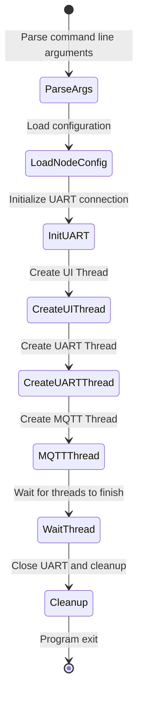
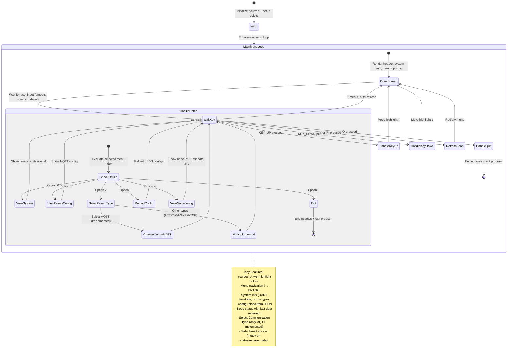
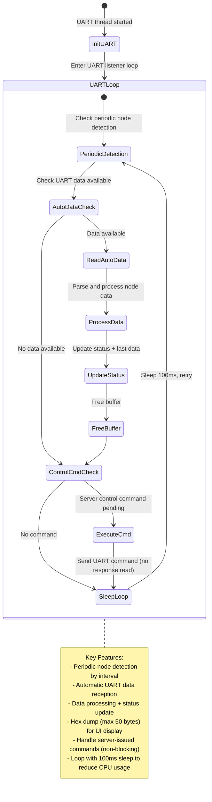
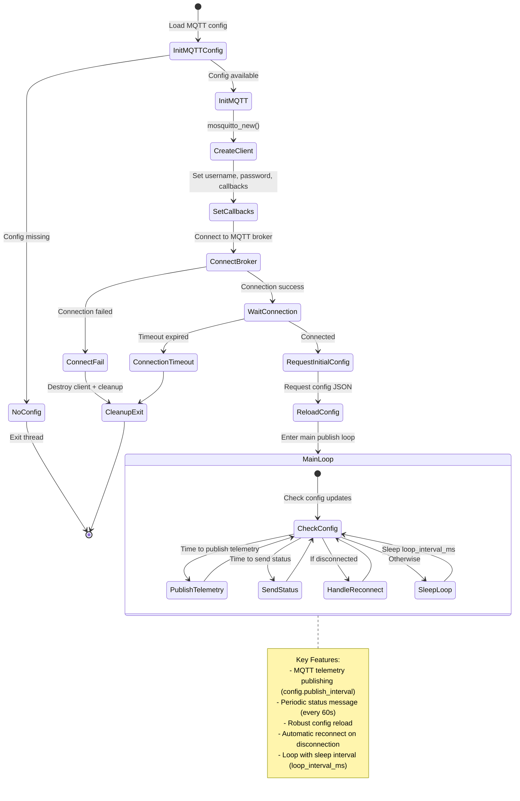

### Sơ đồ hệ thống (sơ đồ chức năng):

## Sơ đồ State Machine Hệ thống

### Main Thread State Machine

### UI (Controller / Configarator) Thread State Machine

### Communication Thread State Machine

### MQTT Send to thingsboard Thread State Machine:

---

