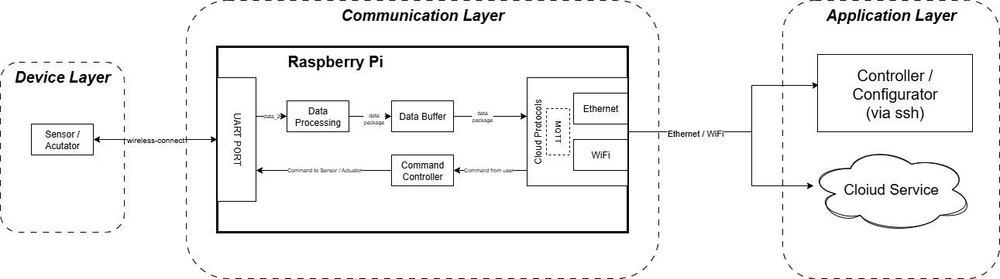
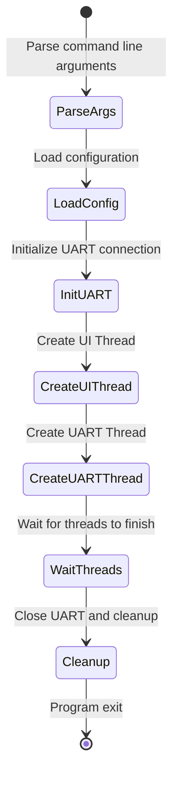
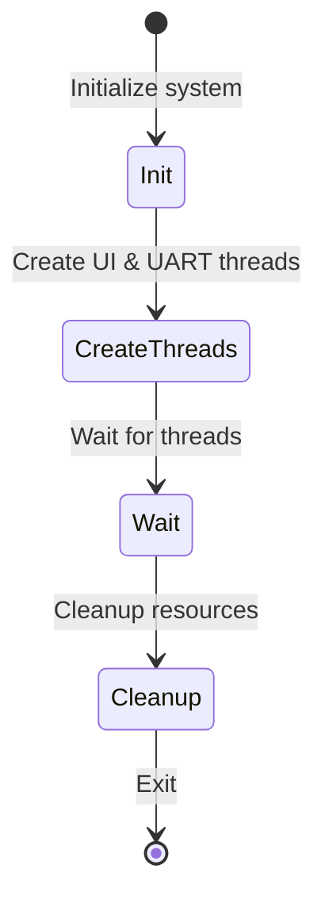
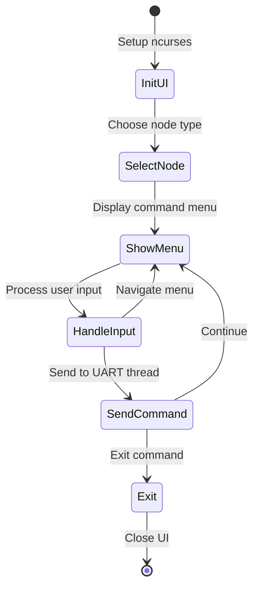
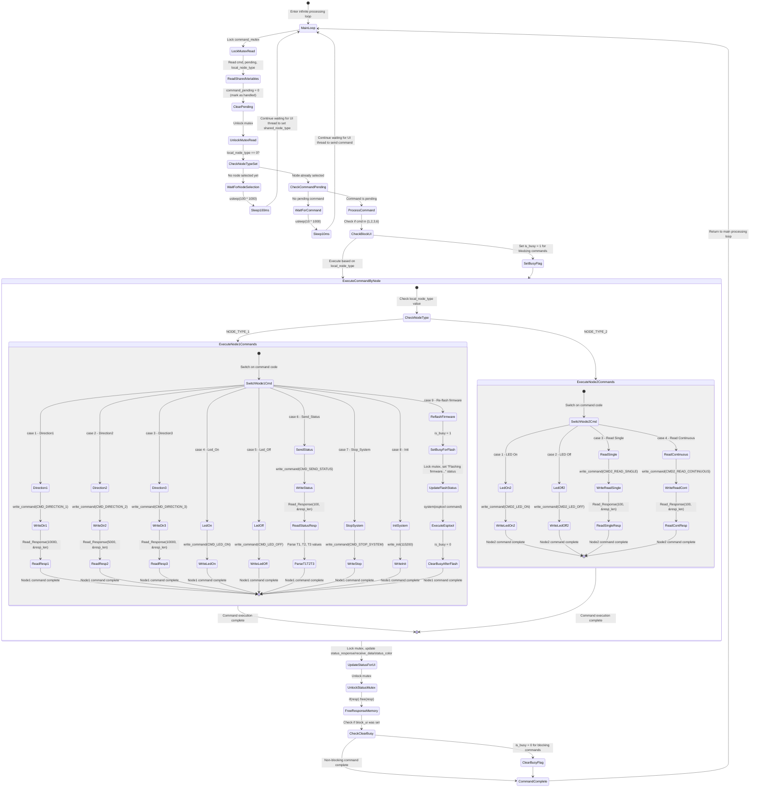
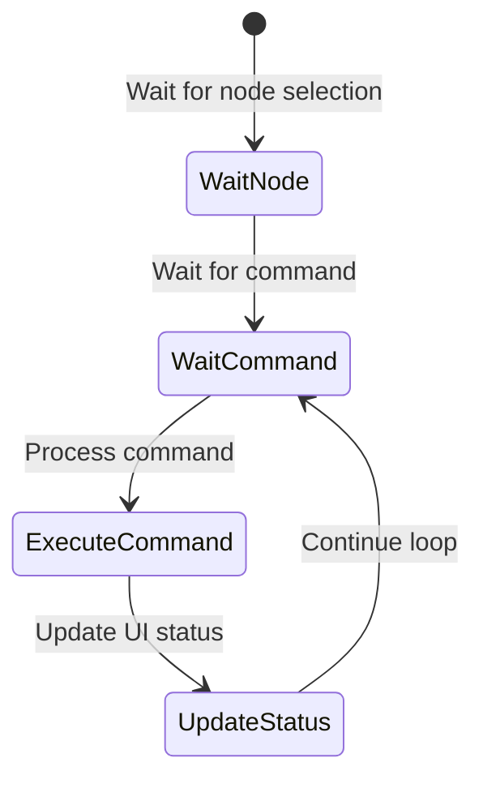
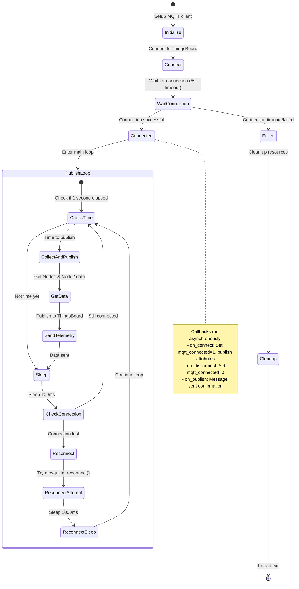
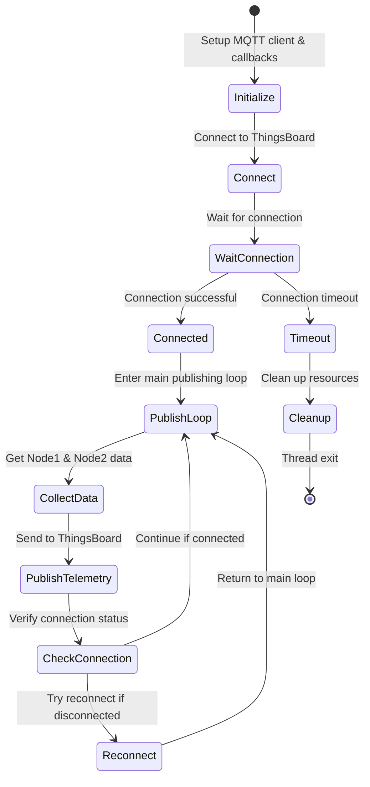

### Sơ đồ hệ thống (sơ đồ chức năng):

## Sơ đồ State Machine Hệ thống

### Main Thread State Machine

#### Bản đơn giản:

### UI (Controller / Configarator) Thread State Machine

```mermaid
    stateDiagram-v2
    [*] --> InitNCurses: Initialize ncurses and colors
    InitNCurses --> NodeSelectionPhase
    
    state NodeSelectionPhase {
        [*] --> ShowNodeMenu: Display node selection menu
        ShowNodeMenu --> WaitNodeInput: Wait for user input
        WaitNodeInput --> HandleKeyUp: KEY_UP
        WaitNodeInput --> HandleKeyDown: KEY_DOWN
        WaitNodeInput --> HandleEnter: ENTER key
        
        HandleKeyUp --> UpdateNodeHighlight: Move highlight up
        HandleKeyDown --> UpdateNodeHighlight: Move highlight down
        UpdateNodeHighlight --> ShowNodeMenu: Redraw menu
        
        HandleEnter --> ValidateNodeSelection: Check if valid node
        ValidateNodeSelection --> ShowNodeError: Invalid node
        ValidateNodeSelection --> NodeSelected: Valid node (NODE_TYPE_1 or NODE_TYPE_2)
        
        ShowNodeError --> WaitErrorInput: Display error and wait
        WaitErrorInput --> ShowNodeMenu: Return to menu
        
        NodeSelected --> [*]: Exit node selection
    }
    
    NodeSelectionPhase --> SetDynamicMenu: Configure menu based on selected node
    SetDynamicMenu --> NotifyUARTThread: Lock mutex, set shared_node_type, unlock
    NotifyUARTThread --> CommandMenuPhase
    
    state CommandMenuPhase {
        [*] --> ShowCommandMenu: Display command menu with system info
        ShowCommandMenu --> ReadStatusFromUART: Lock mutex, read status_response/receive_data/status_color, unlock
        ReadStatusFromUART --> DisplayStatus: Show status and received data
        DisplayStatus --> WaitCommandInput: Wait for user input
        
        WaitCommandInput --> HandleCmdUp: KEY_UP
        WaitCommandInput --> HandleCmdDown: KEY_DOWN  
        WaitCommandInput --> HandleCmdEnter: ENTER key
        
        HandleCmdUp --> UpdateCmdHighlight: Move highlight up
        HandleCmdDown --> UpdateCmdHighlight: Move highlight down
        UpdateCmdHighlight --> ShowCommandMenu: Redraw menu
        
        HandleCmdEnter --> CheckBusyStatus: Read is_busy flag
        CheckBusyStatus --> ShowBusyMessage: System is busy
        CheckBusyStatus --> SendCommandToUART: System ready
        
        ShowBusyMessage --> ShowCommandMenu: Continue menu loop
        
        SendCommandToUART --> LockCommandMutex: Lock command_mutex
        LockCommandMutex --> SetCommandCode: command_code = highlight + 1
        SetCommandCode --> SetCommandPending: command_pending = 1
        SetCommandPending --> UnlockCommandMutex: Unlock mutex
        UnlockCommandMutex --> CheckExitCondition: Check if exit command
        
        CheckExitCondition --> ExitProgram: Exit command for current node
        CheckExitCondition --> ShowCommandMenu: Continue menu loop
        
        ExitProgram --> CleanupUI: endwin(), close(uart_fd)
        CleanupUI --> [*]: pthread_exit(NULL)
    }
    
    CommandMenuPhase --> [*]: UI Thread terminated
```

#### Bản đơn giản:

### Communication Thread State Machine

#### Bản đơn giản:

### MQTT Send to thingsboard Thread State Machine:

### Bản đơn giản:

