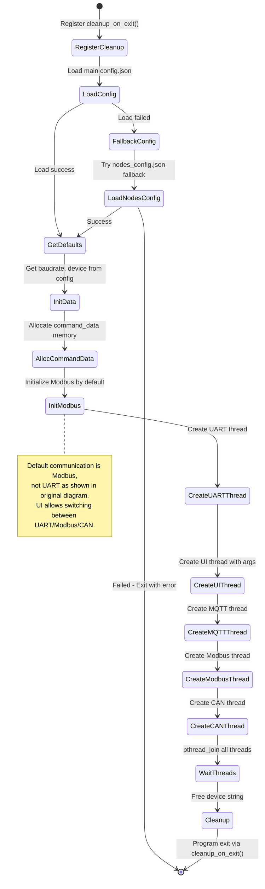
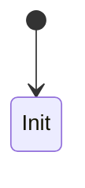
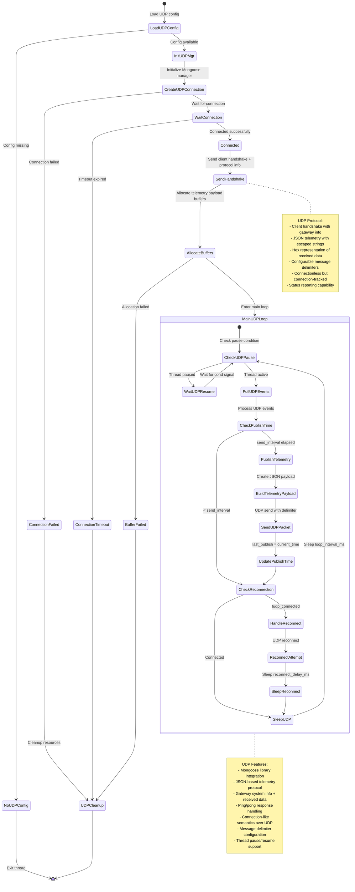

### Sơ đồ hệ thống (sơ đồ chức năng):


## Sơ đồ State Diagram Hệ thống

### Main Thread State Diagram


### Config Thread State Diagram


### Communicate Thread State Diagram
```mermaid

```

### Data Control Thread State Diagram
```mermaid

```

### MQTT Send to thingsboard Thread State Diagram:

```mermaid
stateDiagram-v2
    [*] --> LoadMQTTConfig: Load MQTT config
    LoadMQTTConfig --> NoMQTTConfig: Config missing
    LoadMQTTConfig --> InitMosquitto: Config available
    
    NoMQTTConfig --> [*]: Exit thread
    
    InitMosquitto --> CreateMosquittoClient: mosquitto_new()
    CreateMosquittoClient --> ClientFailed: Creation failed
    CreateMosquittoClient --> SetCredentials: mosquitto_username_pw_set()
    
    ClientFailed --> [*]: Exit thread
    
    SetCredentials --> SetCallbacks: Set connect/disconnect/message callbacks
    SetCallbacks --> ConnectBroker: mosquitto_connect()
    ConnectBroker --> ConnectFailed: Connection failed
    ConnectBroker --> StartLoop: mosquitto_loop_start()
    
    ConnectFailed --> MQTTCleanup: Destroy client + cleanup
    MQTTCleanup --> [*]
    
    StartLoop --> WaitConnection: Wait for mqtt_connected flag
    WaitConnection --> ConnectionTimeout: Timeout expired
    WaitConnection --> RequestInitialConfig: Connected successfully
    
    ConnectionTimeout --> StopLoop: mosquitto_loop_stop
    StopLoop --> MQTTCleanup
    
    RequestInitialConfig --> ConfigRequest: request_config_json_robust()
    ConfigRequest --> WaitConfigResponse: Sleep 3s for response
    WaitConfigResponse --> CheckConfigReload: check_and_reload_config()
    CheckConfigReload --> AllocBuffers: Allocate telemetry + status buffers
    AllocBuffers --> BufferFailed: Allocation failed
    AllocBuffers --> MainMQTTLoop: Enter simplified main loop
    
    BufferFailed --> StopLoop
    
    state MainMQTTLoop {
        [*] --> CheckMQTTPause: Check pause condition
        CheckMQTTPause --> WaitMQTTResume: Thread paused
        CheckMQTTPause --> CheckConfigUpdate: Thread active
        WaitMQTTResume --> CheckMQTTPause: Wait for cond signal
        
        CheckConfigUpdate --> ReloadIfNeeded: check_and_reload_config()
        ReloadIfNeeded --> CheckPublishTime: Config checked
        
        CheckPublishTime --> PublishTelemetry: publish_interval elapsed
        CheckPublishTime --> CheckStatusTime: < publish_interval
        PublishTelemetry --> BuildTelemetryPayload: build_telemetry_payload()
        BuildTelemetryPayload --> SendTelemetry: mosquitto_publish(topic_telemetry)
        SendTelemetry --> UpdatePublishTime: last_publish = current_time
        UpdatePublishTime --> CheckStatusTime
        
        CheckStatusTime --> SendStatusUpdate: 60s elapsed
        CheckStatusTime --> CheckReconnection: < 60s
        SendStatusUpdate --> BuildStatusPayload: JSON status + timestamp + node count
        BuildStatusPayload --> PublishStatus: mosquitto_publish(topic_status)
        PublishStatus --> UpdateStatusTime: last_status = current_time
        UpdateStatusTime --> CheckReconnection
        
        CheckReconnection --> HandleReconnect: !mqtt_connected
        CheckReconnection --> SleepMQTT: Connected
        HandleReconnect --> ReconnectAttempt: mosquitto_reconnect()
        ReconnectAttempt --> SleepReconnect: Sleep reconnect_delay_ms
        SleepReconnect --> SleepMQTT
        SleepMQTT --> CheckMQTTPause: Sleep loop_interval_ms
    }
    
    note right of MainMQTTLoop
        MQTT Features:
        - Mosquitto library integration
        - ThingsBoard protocol support
        - Telemetry publishing (configurable interval)
        - Status updates every 60 seconds
        - Automatic reconnection with delay
        - Config sync from server via attributes
        - RPC command processing
    end note
    
    note right of RequestInitialConfig
        MQTT Callbacks:
        - on_mqtt_connect: Subscribe topics + publish attributes
        - on_mqtt_message_robust: Handle control commands + config updates
        - on_mqtt_disconnect: Set connection status
        - Robust config reload with atomic file writes
    end note
```

---

### TCP Thread State Diagram:

```mermaid
stateDiagram-v2
    [*] --> LoadTCPConfig: Load TCP config
    LoadTCPConfig --> NoTCPConfig: Config missing
    LoadTCPConfig --> InitTCPMgr: Config available

    NoTCPConfig --> [*]: Exit thread

    InitTCPMgr --> InitACKSystem: Initialize Mongoose manager
    InitACKSystem --> CreateTCPConnection: Initialize ACK tracking system
    CreateTCPConnection --> ConnectionFailed: Connection failed
    CreateTCPConnection --> WaitConnection: Wait for connection

    ConnectionFailed --> TCPCleanup: Cleanup resources
    TCPCleanup --> [*]

    WaitConnection --> ConnectionTimeout: Timeout expired
    WaitConnection --> Connected: Connected successfully

    ConnectionTimeout --> TCPCleanup

    Connected --> SendHandshake: Send client handshake + protocol info
    SendHandshake --> AllocateBuffers: Allocate telemetry payload buffers
    AllocateBuffers --> BufferFailed: Allocation failed
    AllocateBuffers --> MainTCPLoop: Enter main loop

    BufferFailed --> TCPCleanup

    state MainTCPLoop {
        [*] --> CheckTCPPause: Check pause condition
        CheckTCPPause --> WaitTCPResume: Thread paused
        CheckTCPPause --> PollTCPEvents: Thread active
        WaitTCPResume --> CheckTCPPause: Wait for cond signal

        PollTCPEvents --> ProcessACKMessages: Process TCP events
        ProcessACKMessages --> CheckMessageTimeouts: Handle incoming ACKs
        CheckMessageTimeouts --> RetryFailedMessages: Check ACK timeouts
        RetryFailedMessages --> CheckPublishTime: Retry unacknowledged messages
        
        CheckPublishTime --> PublishTelemetry: send_interval elapsed
        CheckPublishTime --> CheckReconnection: < send_interval

        PublishTelemetry --> GenerateMessageID: Create JSON payload
        GenerateMessageID --> BuildTelemetryPayload: Generate unique message ID
        BuildTelemetryPayload --> SendTCPDataWithACK: Add message ID to JSON
        SendTCPDataWithACK --> StorePendingMessage: TCP send with delimiter + ACK tracking
        StorePendingMessage --> UpdatePublishTime: Store for ACK verification
        UpdatePublishTime --> CheckReconnection: last_publish = current_time

        CheckReconnection --> HandleReconnect: !tcp_connected
        CheckReconnection --> SleepTCP: Connected
        HandleReconnect --> ReconnectAttempt: TCP reconnect
        ReconnectAttempt --> SleepReconnect: Sleep reconnect_delay_ms
        SleepReconnect --> SleepTCP
        SleepTCP --> CheckTCPPause: Sleep loop_interval_ms
    }

    note right of InitACKSystem
        ACK System Initialization:
        - Clear pending messages array
        - Reset message ID counter
        - Initialize ACK tracking mutex
        - Set timeout and retry parameters
    end note

    note right of MainTCPLoop
        Enhanced TCP Features:
        - Application-level acknowledgment
        - Message ID tracking (unique per message)
        - 5-second ACK timeout with 3 retry attempts
        - Pending message queue (max 16 messages)
        - Automatic ACK response for received messages
        - End-to-end delivery confirmation
        - Thread-safe ACK processing
        - Message cleanup after acknowledgment
    end note

    note right of SendTCPDataWithACK
        Enhanced TCP Protocol:
        - JSON with embedded message_id
        - {"message_id":123,"timestamp":...,"data":...}
        - ACK format: {"type":"ack","message_id":123}
        - Automatic retry on timeout
        - Delivery status tracking
        - Backward compatibility support
    end note

    note right of ProcessACKMessages
        ACK Message Handling:
        - Detect incoming ACK messages
        - Extract message_id from ACK
        - Mark corresponding message as acknowledged
        - Remove from pending message queue
        - Send ACK response for received messages
        - Process ping/pong responses
    end note
```


### UDP Thread State Diagram:
