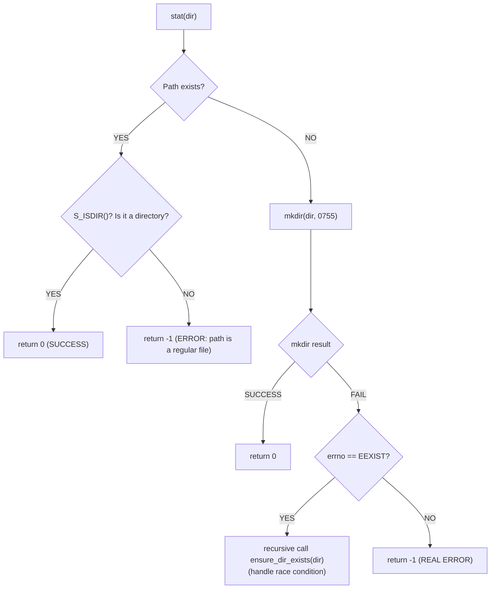
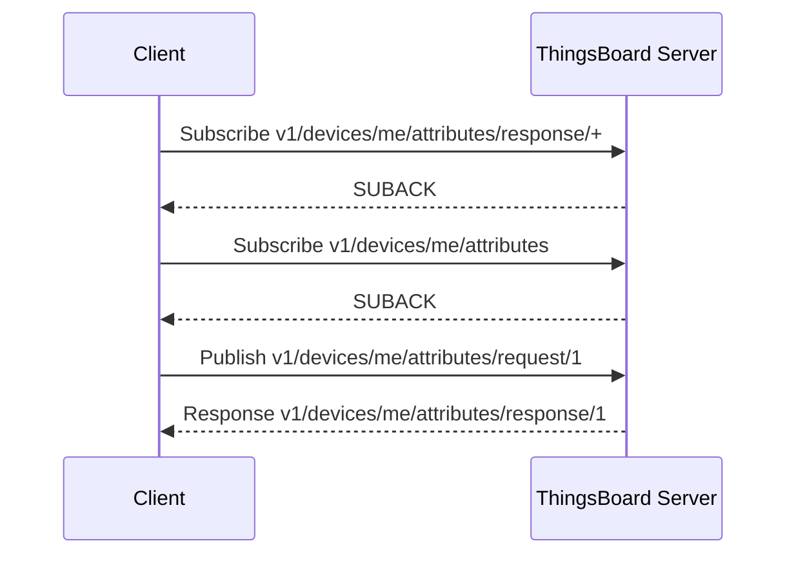

# Giải thích Chi tiết Cách Phức Tạp: Chức năng và Cách Hoạt động

## Kiến trúc Tổng thể

Cách phức tạp được thiết kế theo mô hình nhiều lớp bảo vệ (**defense in depth**) với 4 thành phần chính:

```
┌─────────────────────────────────────────────┐
│           MQTT Message Handler              │
│  ┌─────────────┐  ┌─────────────────────┐   │
│  │ Validation  │  │  Error Handling     │   │
│  │   Layer     │  │      Layer          │   │
│  └─────────────┘  └─────────────────────┘   │
└─────────────────────────────────────────────┘
                    │
                    ▼
┌─────────────────────────────────────────────┐
│         Atomic File Operations              │
│  ┌─────────────┐  ┌─────────────────────┐   │
│  │ Temp Write  │  │    Atomic Rename    │   │
│  │  + fsync    │  │    + dir fsync      │   │
│  └─────────────┘  └─────────────────────┘   │
└─────────────────────────────────────────────┘
                    │
                    ▼
┌─────────────────────────────────────────────┐
│           File System Layer                 │
│         /home/pi/config/config.json         │
└─────────────────────────────────────────────┘
```


## Chi tiết Từng Thành phần

### 1. `ensure_directory_exists()` — Quản lý Thư mục
```c
static int ensure_directory_exists(const char *dir)
```

**Chức năng**: Đảm bảo thư mục đích tồn tại trước khi ghi file.

**Cách hoạt động**:


**Xử lý race condition**:
- Thread A kiểm tra → không tồn tại
- Thread B tạo thư mục trước
- Thread A gọi `mkdir()` → EEXIST → gọi lại `ensure_directory_exists()`


### 2. `validate_json_basic()` — Validation Layer
```c
static int validate_json_basic(const void *data, size_t size)
```

**Chức năng**: Kiểm tra tính hợp lệ cơ bản của JSON trước khi ghi.

**Validation checklist**:
```
┌─ NULL/Empty Check ────────────────────┐
│ if (!data || size == 0) → ERROR       │
└───────────────────────────────────────┘
           │
           ▼
┌─ Size Limit Check ────────────────────┐
│ if (size > 1MB) → ERROR                │
└───────────────────────────────────────┘
           │
           ▼
┌─ JSON Structure Check ────────────────┐
│ if (first_char != '{') → ERROR         │
│ if (no_closing_brace) → ERROR          │
└───────────────────────────────────────┘
           │
           ▼
         SUCCESS
```

**Lý do validation**:
- Bảo vệ hệ thống: tránh JSON quá lớn gây cạn RAM  
- Early detection: phát hiện lỗi format trước khi ghi file  
- Resource protection: tránh ghi file rác  


### 3. `atomic_write_json_file()` — Cốt lõi Atomic Operations
```c
static int atomic_write_json_file(const char *dir, const char *filename, 
                                  const void *data, size_t size)
```

**Chức năng**: Ghi file JSON đảm bảo tính nguyên tử (atomic).

#### Phase 1: Preparation
```c
ensure_directory_exists(dir);
snprintf(tmp_path, "config.json.tmp");
snprintf(final_path, "config.json");
```

#### Phase 2: Write to Temporary File
```c
fd = open(tmp_path, O_WRONLY|O_CREAT|O_TRUNC, 0644);
while (total_written < size) {
    written = write(fd, data + total_written, remaining);
    if (written < 0) {
        if (errno == EINTR) continue;
        cleanup_and_exit();
    }
    total_written += written;
}
```
- **Partial write handling**: xử lý khi `write()` không ghi hết dữ liệu trong một lần gọi.

#### Phase 3: Durability Guarantee
```c
fsync(fd);
close(fd);
```
- `fsync()` buộc flush từ kernel buffer xuống disk để chống mất dữ liệu khi mất điện.

#### Phase 4: Atomic Rename
```c
rename(tmp_path, final_path);
```
- Rename là thao tác nguyên tử ở filesystem.

#### Phase 5: Directory Metadata Sync
```c
dirfd = open(dir, O_DIRECTORY|O_RDONLY);
fsync(dirfd);
close(dirfd);
```
- Đảm bảo metadata thư mục cũng được flush.

---

### 4. `on_mqtt_message_robust()` — Message Handler

**Luồng xử lý**:
```
MQTT Message Received
        │
        ▼
┌─ Topic Filter ────────────────────────┐
│ if (contains "attributes/response")   │
│    → Process config                   │
│ elif (equals "v1/devices/me/attr")    │
│    → Process push update               │
│ else → Ignore                          │
└───────────────────────────────────────┘
        │
        ▼
┌─ Data Validation ─────────────────────┐
│ validate_json_basic(payload, size)    │
│ ├─ PASS → Continue                    │
│ └─ FAIL → Log error + return           │
└───────────────────────────────────────┘
        │
        ▼
┌─ Preview Logging ─────────────────────┐
│ Log first 200 bytes for debugging     │
└───────────────────────────────────────┘
        │
        ▼
┌─ Atomic Write ────────────────────────┐
│ atomic_write_json_file()               │
│ ├─ SUCCESS → Log success               │
│ └─ FAIL → Log error                    │
└───────────────────────────────────────┘
```

---

### 5. `request_config_json_robust()` — Request Handler

**Sequence diagram**:


## Error Handling Strategy

### 1. Defense in Depth
```
Layer 1: Input Validation (size, format)
   ↓
Layer 2: System Call Error Checking (open, write, fsync)
   ↓  
Layer 3: Cleanup on Failure (unlink temp files)
   ↓
Layer 4: Detailed Logging (debug information)
```

### 2. Error Recovery Pattern
```c
operation_result = system_call();
if (operation_result != SUCCESS) {
    log_error_with_context();
    cleanup_resources();
    return ERROR_CODE;
}
```

### 3. Resource Management
- **RAII-style**: Mở → dùng → cleanup mọi path  
- **Fail-fast**: Phát hiện lỗi sớm, không lan truyền  
- **Idempotent**: Có thể gọi lại mà không gây side effect  

---

## Ưu điểm của Architecture này

1. **Crash Resistance**  
   - File config không bị corrupted  
   - Luôn có file hợp lệ khi khởi động  
   - Chịu được mất điện, kernel panic, disk full  

2. **Debugging Capability**  
   - Log chi tiết từng bước  
   - Preview data giúp tìm lỗi  
   - Error codes cụ thể  

3. **Production Readiness**  
   - Thread-safe  
   - Không rò rỉ tài nguyên  
   - Xử lý lỗi toàn diện  
   - Hiệu năng chấp nhận được (~10ms overhead)  

4. **Maintainability**  
   - Phân tách rõ ràng  
   - Mẫu xử lý lỗi nhất quán  
   - Code tự giải thích với comment chi tiết  
